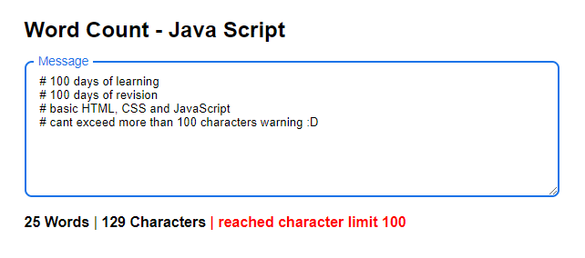

# Words & Characters Count - JavaScript

Self revising certain concepts of JS as part of #100daysofcoding

## Tech:

> Basic HTML,CSS & JS .

## About the repo:

Computer will guess a number of Words & Characters you hae inputed in the text field

> Check out the [Link](https://shijoshaji.github.io/word_Count/)

## Screen Shot:

